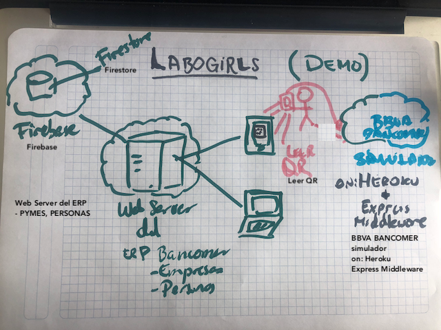

# Labogirls
ERP para emprendedores, by BBVABancomer

## UX Research 

### Necesidades Identificadas

### Benchmark 

### Funcionalidades Identificadas 

- [ ] Conciliación de pagos QR

- [ ] Disponibilidad de cobros en cualquier lugar. 

- [ ] Correos a Clientes, transacción en línea.

- [ ] Administración de los inventarios del comercio.

### Arquitectura 

;